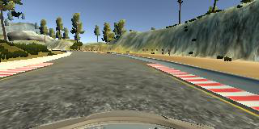
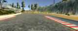
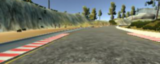
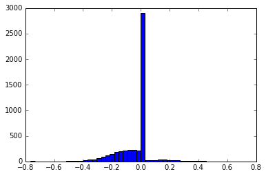
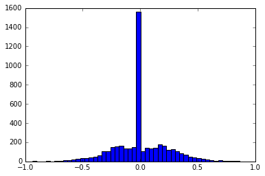
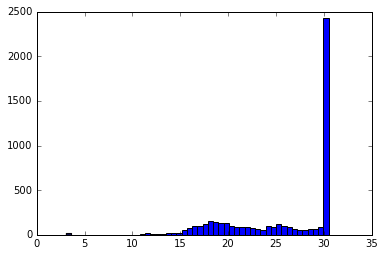
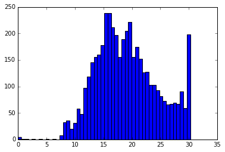

## Project: Behavioral Cloning

In this project we are going to teach the car to stay on track.

### Collecting Training Data

The simulator has been run on smallest size and fastest graphical settings.  After activating recording in training mode we will get saved 3 images every 0.1 second - one center camera image, one left and one right camera image.  Image file location, steering angle, throttle and speed are recorded in driving_log.csv file.  The images have 160x320 pixels, color RGB uint8 format.

There are 2 car tracks.  I've collected about 15,000 images on the first track (3 laps) and about 14,000 images on the second track (going to the end in both directions).  I was trying to keep the car in the center and I was slowing down at sharp turns or at reduced road visibility but I didn't trained specially for recovery.

### Image Preprocessing

The saved image is 320 pixels wide and 160 pixels high.  

At importing the image I ignore the lower 20 pixels - because this part contains the hood of the car and I don't want the network to figure out whether I'm using left, right or center camera.  I also ignore the upper 12 pixels, mainly to have in the end a nice 128 pixels height.  These upper twelve pixels are mainly clouds, usually not relevant for road direction.

A Gaussian blur is applied:

 and the size is shrunk to half in both dimensions becoming 64x160 pixels.  

Every  image is flipped around the vertical axis:

 and both images (before and after flip) are added to the input sequence after converting to float32 and normalizing to the range [-0.5, 0.5]

### Label Preprocessing

The steering_angle in my training data is in range [-0.6, 0,6] with most values around 0 and slight left turns on track1 (closed circuit):

Left and right turns have almost symmetric distribution on track2:

Steering angle corresponding to center camera is left unchanged.  Values corresponding to left camera are added a shift value about 0.15 and for the right camera we subtract this value.  These shift values are about 2..3 times more what the model predicted for only left or only right camera images when the training has been done on center camera images only.  When driving we are going to use only the center camera images for prediction and the augmented shift values will instruct the car to go back towards the center of the road.

To make it more realistic I'm storing and predicting the speed values as well.  Originally the speed is in range [0, 30].  
On track1 most of the time I was going with maximum speed:

On track2 speed is more evenly distributed with smaller peeks around 15, 20 and 30:

 I set all speed less than 10 to 10 supposing that this speed is safe enough to take the sharpest turns in a realistic scenario.  
The  speed data is normalized to a range [-0.2, 0.2].  This range is  smaller than the steering angle range because speed accuracy is not so critical.

### The Model

There are 4 CNN layers and 3 fully connected layers.  The CNN layers have kernel size (5,5) except the last layer which has kernel size (3,3).  Every layer has batch normalization (to speed up learning).  The CNN layers got ELU activation (for fast and accurate learning) and max pooling with pool size (2,2).  
The resulted 96 "images" of 4x10 "pixels" are flattened out and followed by 3 fully connected layers with 2048, 512 and 128 neurons including a dropout and a sigmoid activation.  The output dimension is 2 - corresponding to the steering angle and to the speed values.

### The Training

The batch size is set to 32 and we are going to use Adam optimizer.  The validation data takes 5% of the training samples.

On track1 convergence happens after 2 epochs while track2 is converging after 9 epochs.  The huge difference

### Running Drive Predictions

Use command 

python drive.py model.json

to start autonomous driving in "classical" mode  with full throttle and maximum speed.

Use command

python drive.py model.json -s

to start autonomous driving with steering and speed control.

